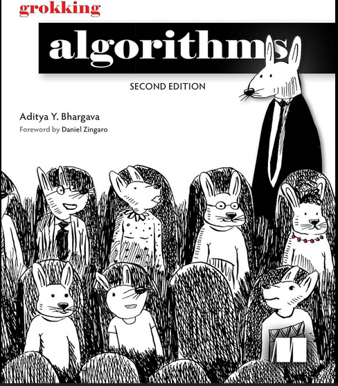

# Data Structures from *Grokking Algorithms*

This repository contains implementations of various data structures I’ve learned from the book *Grokking Algorithms*.  
Each module is written with clarity and educational value in mind.

  

---

## Currently Implemented

- Stack  
- Queue  
- Linked List  
- Circular Linked List  
- Doubly Linked List  

---

## Coming Soon

The following data structures and algorithms will be added as I continue learning:

- Tree  
- Binary Search Tree (BST)  
- Huffman Tree  
- Dijkstra's Algorithm  
- AVL Tree  
- Heap  
- Graph  

---

Feel free to explore the code and follow along with the learning process. Contributions and feedback are always welcome.

